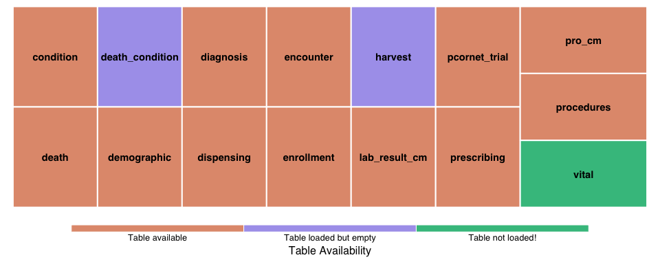
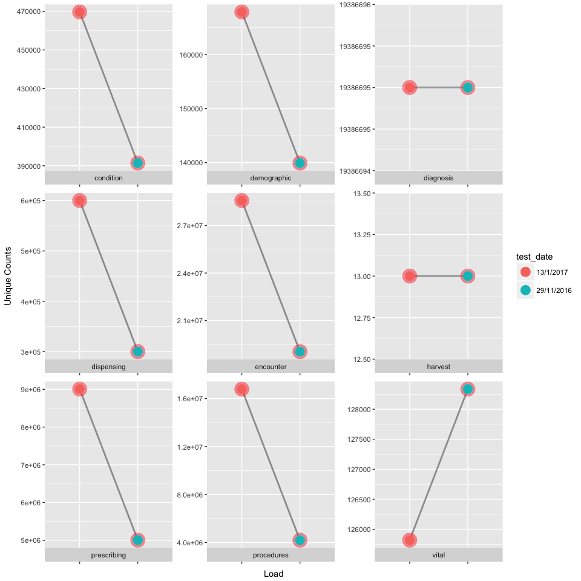
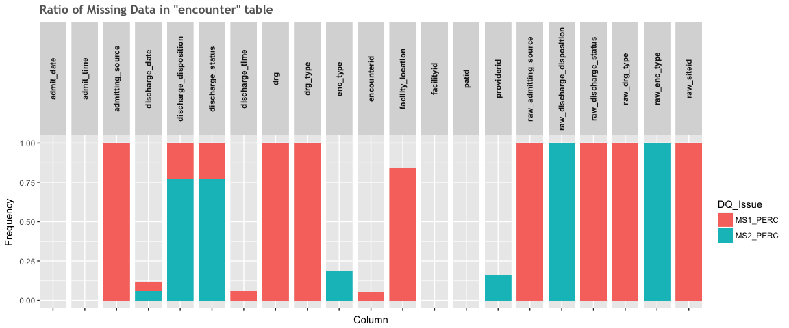
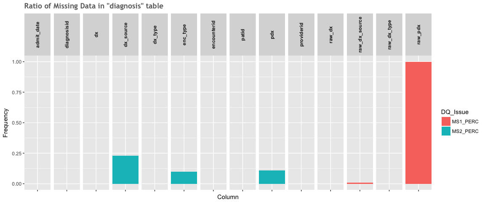

##DQe-c Architecture

DQe-c is a modular tool developed in R statistical language for assessing completeness in EHR data repositories. The tool also performs a data model conformance test that pertain to data completeness. Each run of DQe-c produces a web-based report (.html document) that include visualizations of the data completeness test at a given time (or data load) and changes in key frequencies over time. Data preparation, analyses, and visualizations are performed under seven modules, where each module consists of one or more R scripts (Figure 1). Modules one to six perform data preparation and analyses and store their outputs as comma-separated flat files in the reports directory. The modular design increases flexibility of the tool for future improvements and facilitates interoperability.

### Figure 1. DQe-c Workflow.

###1- Set up and execution module
The set up and execution module consists of three scripts. All necessary packages are loaded in lib.R, called by RUN.R script. DQe-c’s execution is governed by the RUN.R script, which initiates three modules one after each other (order of initiations are identified in Figure 1). Scripts within each module initiate their dependent scripts, respectively. The latest version of DQe-c (3.1) works on two common data models (CDM), PCORnet version 3 and OMOP version 5. The tool also operates on two Relational Database Management System (RDBMS), MS SQL Server and PostgreSQL, calling SQL queries from within R commands via JDBC/ODBC connection. This capability increases scalability of the tool against large EHR repositories. 

To run DQe-c, the user needs to: (1) specify execution parameters in the RUN.R script, including CDM, SQL, organization name, and database specifications, and (2) set up SQL connection credentials in the keys.R script.

###2- Connectivity module
The third (and final) step to run DQe-c is to specify SQL connection information (i.e., data base driver, data base name, host address, and connection port) in from connectivity module. This module establishes the JDBC/ODBC connection with the respective RDBMS.

###3- Clinical indicators module
The clinical indicators module performs tests to count frequencies of patients without information on key clinical indicators. The development and addition of this module was inspired in a  collaboration with DARTNet Institute,25 while implementing an earlier version of DQe-c into their data repository. Selection of clinical indicators in this module is flexible and can be customized based on local needs. This module initiates the data model module as a dependency.

###4- Data model module
The data model module performs data model-related completeness test. DQe-c version 3.1 checks for the existence of orphan foreign keys in the database, based on the relational constrains. This test looks at completeness from a conformance point of view. More data model-related checks will be added to the future versions of DQe-c through this module. The module initiates its dependent data preparation module.

###5- Data preparation module
Data preparation module operate the first data operations after the connection to the SQL is established. After the execution parameters are set in the RUN.R, script prep.R reads the respective data model template (OMOP v5 vs. PCORnet V3) and prepares the system to call respective SQL queries (MS SQL Server vs. PostgreSQL). Two comma-separated flat file provide the CDM templates for DQe-c to operate. The first step to expanding the tools functionality to other CDMs is to create a new CDM template and modify the data preparation module. This script creates a reference table for processing in freq.R, which counts and stores frequencies of rows and unique values in each rows. Results of these counts are added to the reference table and will be used by the missingness module for further processing. 

###6- Missingness module
The missingness module calculates percentage of missing values for each column of each tables available in the database. The results complete the reference table created in the data preparation model, and used by the visualization and presentation module to generate the DQe-c report.

###7- Visualization and presentation module
The visualization and presentation module includes an R Markdown document that generates the HTML report from completeness tests conducted through DQe-c. This module uses the outputs of its preceding modules, as they are stored with specific names as comma-separated flat files in the reports directory. We will provide a brief description of DQe-c report in the next section.

##DQe-c Outputs
Each run of DQe-c generates an HTML report that summarizes outputs from its data preparation and analytics in tables and graph visualizations. The report is organized in four sections.

###1-Load and test details
The first section of the report presents a databased-level snapshot summary of the latest data loaded in the clinical repository. The summary includes a table that present a list of CDM tables, their availability status (in three categories: (1) available, (2) loaded but empty, (3) not loaded), Gigabyte size and number of rows for each table. These information are then presented in three visualizations (Figures 2, 3, and 4). Data for this section of the report was generated by the data preparation module.

#### Figure 2. Available Tables, Compared to all CDM Tables
This figure shows which of the CDM tables was received (and not received). 

#### Figure 3. File Size and Row Numbers by Table in the Load

#### Figure 4. Loaded tables against CDM Relational Model.
The figure below shows a network visualization of the CDM data model, as well as highlighting the tables that are available in this load (legend is the same as in Figure 2).

Figure to follow!

### 2- Completeness Results
Second section of the report illustrates the results of data preparation and missingness modules. This section profiles changes over time in primary keys across loads (Figure 5). This visualization can help to obtain a better understanding of changes in a given clinical data repository over loads.

### Figure 5. Changes in Primary Keys Across Loads
Figure below profiles changes in primary keys across loads as a measure of change in patient/record number over time.

### Figure 6. Proportion of Missing Data by Type in Loaded Tables
Figures below show proportion of missing cells/values in each column of each table loaded. Figures are generated based on Table 2. 

* `MS1_FRQ` = Frequency of cells with NULL/NA values and empty strings in each column
* `MS2_FRQ` = Frequency of cells with characters in each column that don't represent meaningful data

##Data Model Tests

### Figure 7. Common Key Variables
Figures below visualize number of unique key variables that are common in multiple tables. 

* The Reference column on the right comes from the table in which the variable is a primary key, and therefore is a reference for all other tables. 

* Count_Out shows number of unique key variables that are not present in the reference table -- e.g., person id from observation table that does not exist in person table.

* Count_In represent number of unique key variables that are present in the reference table -- e.g., person id from observation table that exist in person table as well.

Figure to follow!

##Test of Completeness in Key Clinical Indicators

### Figure 8. Common Key Variables
Figure 8 shows the parcentage of patients missing specific key clinical indicators. 

##info
This is an example report from DQe-c version on 3.1 PCORnet v3 CDM

For questions and/or inquiries email: `hestiri@mgh.harvard.edu`

