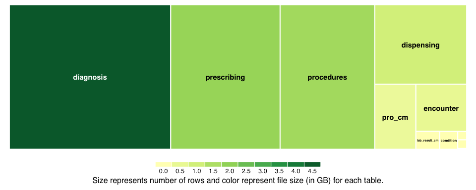
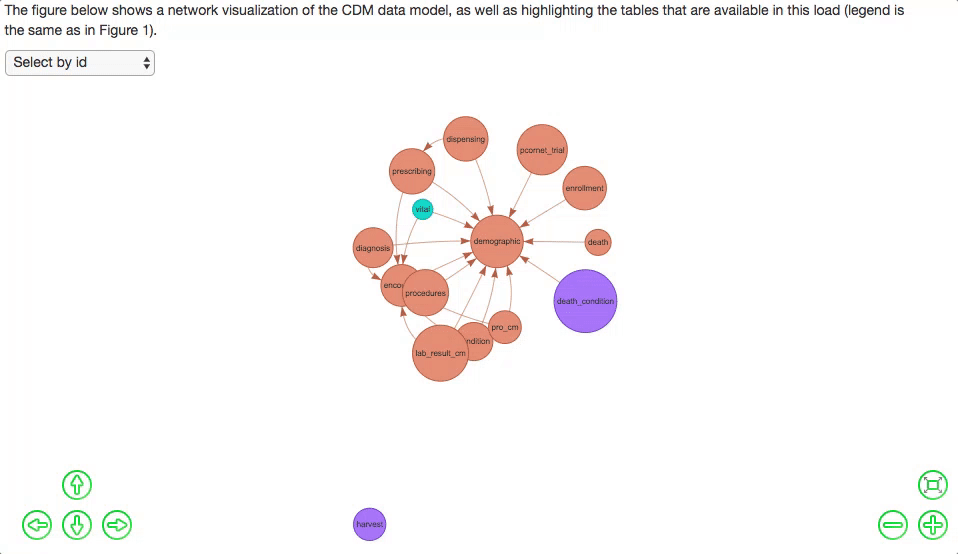
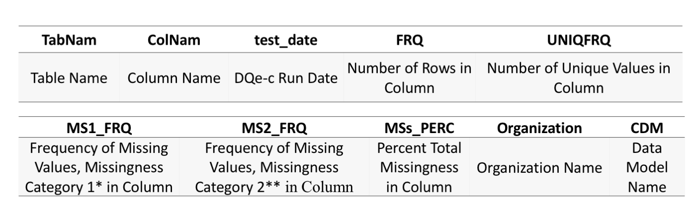
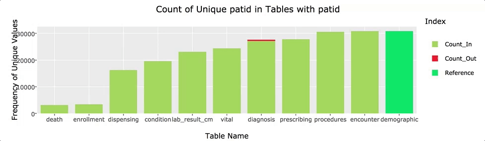
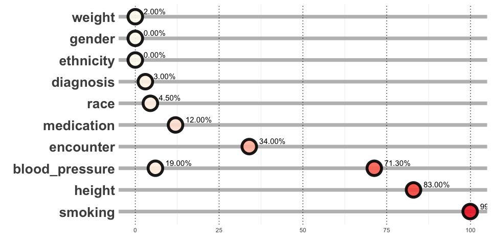

##DQe-c Architecture

DQe-c is a modular tool developed in R statistical language for assessing completeness in EHR data repositories. The tool also performs a data model conformance test that pertain to data completeness. Each run of DQe-c produces a web-based report (.html document) that include visualizations of the data completeness test at a given time (or data load) and changes in key frequencies over time. Data preparation, analyses, and visualizations are performed under seven modules, where each module consists of one or more R scripts (Figure 1). Modules one to six perform data preparation and analyses and store their outputs as comma-separated flat files in the reports directory. The modular design increases flexibility of the tool for future improvements and facilitates interoperability.

### Figure 1. DQe-c Workflow.

###1- Set up and execution module
The set up and execution module consists of three scripts. All necessary packages are loaded in lib.R, called by RUN.R script. DQe-c’s execution is governed by the RUN.R script, which initiates three modules one after each other (order of initiations are identified in Figure 1). Scripts within each module initiate their dependent scripts, respectively. The latest version of DQe-c (3.1) works on two common data models (CDM), PCORnet version 3 and OMOP version 5. The tool also operates on two Relational Database Management System (RDBMS), MS SQL Server and PostgreSQL, calling SQL queries from within R commands via JDBC/ODBC connection. This capability increases scalability of the tool against large EHR repositories. 

To run DQe-c, the user needs to: (1) specify execution parameters in the RUN.R script, including CDM, SQL, organization name, and database specifications, and (2) set up SQL connection credentials in the keys.R script.

###2- Connectivity module
The third (and final) step to run DQe-c is to specify SQL connection information (i.e., data base driver, data base name, host address, and connection port) in from connectivity module. This module establishes the JDBC/ODBC connection with the respective RDBMS.

###3- Clinical indicators module
The clinical indicators module performs tests to count frequencies of patients without information on key clinical indicators. The development and addition of this module was inspired in a  collaboration with DARTNet Institute,25 while implementing an earlier version of DQe-c into their data repository. Selection of clinical indicators in this module is flexible and can be customized based on local needs. This module initiates the data model module as a dependency.

###4- Data model module
The data model module performs data model-related completeness test. DQe-c version 3.1 checks for the existence of orphan foreign keys in the database, based on the relational constrains. This test looks at completeness from a conformance point of view. More data model-related checks will be added to the future versions of DQe-c through this module. The module initiates its dependent data preparation module.

###5- Data preparation module
Data preparation module operate the first data operations after the connection to the SQL is established. After the execution parameters are set in the RUN.R, script prep.R reads the respective data model template (OMOP v5 vs. PCORnet V3) and prepares the system to call respective SQL queries (MS SQL Server vs. PostgreSQL). Two comma-separated flat file provide the CDM templates for DQe-c to operate. The first step to expanding the tools functionality to other CDMs is to create a new CDM template and modify the data preparation module. This script creates a reference table for processing in freq.R, which counts and stores frequencies of rows and unique values in each rows. Results of these counts are added to the reference table and will be used by the missingness module for further processing. 

###6- Missingness module
The missingness module calculates percentage of missing values for each column of each tables available in the database. The results complete the reference table created in the data preparation model, and used by the visualization and presentation module to generate the DQe-c report.

###7- Visualization and presentation module
The visualization and presentation module includes an R Markdown document that generates the HTML report from completeness tests conducted through DQe-c. This module uses the outputs of its preceding modules, as they are stored with specific names as comma-separated flat files in the reports directory. We will provide a brief description of DQe-c report in the next section.

##DQe-c Outputs
Each run of DQe-c generates an HTML report that summarizes outputs from its data preparation and analytics in tables and graph visualizations. The report is organized in four sections.

###1-Load and test details
The first section of the report presents a databased-level snapshot summary of the latest data loaded in the clinical repository. The summary includes a table that present a list of CDM tables, their availability status (in three categories: (1) available, (2) loaded but empty, (3) not loaded), Gigabyte size and number of rows for each table. These information are then presented in three visualizations (Figures 2, 3, and 4). Data for this section of the report was generated by the data preparation module.

#### Figure 2. Load Details:
#####Available Tables, Compared to all CDM Tables
This figure shows which of the CDM tables was received (and not received). 

##### File Size and Row Numbers by Table in the Load

#####Loaded tables against CDM Relational Model.
The figure below shows a network visualization of the CDM data model, as well as highlighting the tables that are available in this load (legend is the same as in Figure 2).

### 2- Completeness Results
Second section of the report illustrates the results of data preparation and missingness modules. Upon the completion of each run of DQe-c, a reference table is produced and saved in the `reports` directory, under the `mstabs` directory that includes a frequencies of rows, unique values, missingness, and percent missingness for each column and each table (Table 1 provides a description of the columns and their content in the reference table). We call this table the “Master Completeness Results” (MCR) table.
 
Table 1. Columns and Content of the Reference Table.

* category 1 of missingness measures presence of absence

** category 2 of missingness measures presence of nonsense

As we described briefly in the introduction, our approach to missingness/completeness encompasses a broad connotation. We measure completeness as presence of “sensical” data, regardless of whether a data point is plausible or not. That is, if for any reasons a data point does not include a value or an attribute that is compatible for analysis – i.e., the analyst needs to treat the data point with missing data procedures –  we will consider it as missing data. Accordingly, DQe-c differentiates two types of missingness: (1) presence of absence (MS1), and (2) presence of nonsense (MS2). We describe the two types in next sections. Category 1 of missingness (MS1) is the conventional definition for missingness, counting frequency of NULL/NA values or empty strings in each column. Category 2 of missingness (MS2) can be defined by the user. We currently consider data points with characters including '+', '-', '_','#', '$', '*', '\', '?', '.', '&', '^', '%', '!', '@', and 'NI' in MS2 category. This list can be easily modified in the missingness module.

####2-1- Changes in Primary Keys Across Loads
Before presenting the results of missingness for each table, DQe-c first visualizes how completeness in key variables changes over time/data loads. The purpose of this visualization is to compare key quantities of presence over time to track potential significant changes in a clinical data repository. For this purpose, DQe-c profiles changes over time in primary keys for available tables across loads (Figure 3). The tool uses reports from previous runs to automatically compile data for this visualization.

##### Figure 3: Changes in primary keys across loads.

#### 2-2- Proportion of Missing Data in Loaded Tables

DQe-c differentiates two types of missingness (MS1 and MS2) and visualizes the output by column for each of the tables available from the CDM. Figure 4 presents an example of two encounter and diagnosis tables from PCORnet v3 CDM, using fabricated data. Data for this visualization is from on the MCR table. The figure shows that, for instance, there is around 15% missingness in columns providerid, enc_type, and pdx from tables encounter and diagnosis, which are all due to an existence of a nonsensical character. 
 
##### Figure 4: Missingness percentage by table and column.

As Figure 4 illustrates, some columns have missingness of category 1 (NULL/NA/empty string), and some have a combination of cells with both categories of missingness. The bar chart visualizations distinguish between the two but also allow the user(s) to see the overall missingness percentage. 

###3- Data Model Test(s)
The data model module in DQe-c provides the capability for the tool to perform data model tests that are related to completeness. The current version of the tool (DQe-c v3.1) performs a test that looks for orphan records among common key variables, based on the CDM constraints. Results are visualized in a series of interactive bar charts. Figure 5 presents an example of patid variable in PCORnet v3 CDM. 

#### Figure 5. Orphan rows in common key variables
Figures below visualize number of unique key variables that are common in multiple tables. 

* The Reference column on the right comes from the table in which the variable is a primary key, and therefore is a reference for all other tables. 

* Count_Out shows number of unique key variables that are not present in the reference table -- e.g., person id from observation table that does not exist in person table.

* Count_In represent number of unique key variables that are present in the reference table -- e.g., person id from observation table that exist in person table as well.

The procedure to identify and visualize orphan records begins with identifying common variables among tables of the CDM. A table is identified as the reference table for each common variable in the data model module. For example, in PCORnet v3 CDM, demographic table is the reference table for patid. That is, all other patids in tables that have a patid column should be included in patids in the demographic table, otherwise are identified as orphan rows. The data model module has functions to categorize each unique value in common keys under `Count_In` or `Count_Out` (orphan rows), based on the unique values available in the reference table. Figure 4, for instance, shows that there is a small proportion of orphan patids in diagnosis table – i.e., a small number of patids in diagnosis table are not available in the demographic table. If the overall frequency of unique values in a common variable (e.g., patid) is more than the frequency of unique values in the reference table, it is likely that there are orphan rows. Orphan rows can also exist due to ETL issues.

###4- Test of Completeness in Key Clinical Indicators
All of the completeness tests that DQe-c preforms up to here are informatics-based – i.e., treat data without reference to their clinical meaning. The clinical indicators module in DQe-c enables the user(s) to evaluate data completeness from a subjective viewpoint. The tool calculates the proportion of patients who miss data on key clinical indicators, such as height, weight, blood pressure, medication, diagnosis, and encounter records, and demographic data including gender, race, and ethnicity (Figure 6). 

#### Figure 8. Test of completeness in key clinical indicators
Figure 5 shows the parcentage of patients missing specific key clinical indicators. 

##info
This is an example report from DQe-c version 3.1 on PCORnet v3 CDM

For questions and/or inquiries email: `hestiri@mgh.harvard.edu`

